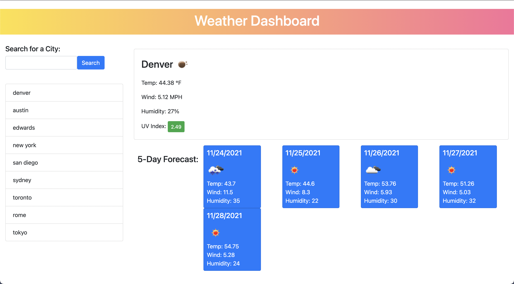

# weather-api

The objective for this homework assignment was to access a third-party API to pull data using specific parameters to a URL. For this assignment I used the open weather API to build a responsive weather dashboard that dynamically updates the HTML and CSS using JQUERY.

[weather-api live link](https://masonfibkins.github.io/weather-api/)

